# Predicting-Heart-Failure-using-Clinical-Data
Statistical Modeling of Mortality Risk in Heart Failure

Chetan Dhingra|1862481|<cdhingra@ualberta.ca>

**Introduction:**

The goal of this project is to determine whether clinical indicators can be used to forecast a patient's risk of dying from heart failure. We aim to develop prediction models that will use various clinical markers and assess their relationship with the event of survival or death of a patient post a heart failure event based on some training data and then use these characteristics to further predict whether a new patient will survive or die depending on the values of these clinical markers.

**Basic Science Background**

Heart failure (HF) is a chronic condition where the heart ceases to pump blood efficiently, leading to the build-up of fluid and a decrease in appropriate oxygen supply for organs and tissues. It is one of the leading causes of hospitalization and deaths worldwide, with various underlying risk factors such as age, high blood pressure, diabetes, anemia, and impaired kidney functions contributing to its progression. Medical professionals typically monitor various health indicators like ejection fraction, serum creatinine levels, and platelet count to assess the severity of the condition and predict potential adverse outcomes.

**Explanation of Dataset:**

The dataset has been taken from the UCI website: Heart Failure Clinical Records [Dataset]. (2020). UCI Machine Learning Repository. https://doi.org/10.24432/C5Z89R.

|**Variable Name**|**Role**|**Type**|**Description**|**Units**|
| - | - | - | - | - |
|age|Feature|Integer|Age of the patient|Years|
|anaemia|Feature|Binary|Decrease in red blood cells or hemoglobin|Yes/No(1,0)|
|creatinine\_phosphokin ase|Feature|Integer|Level of creatinine phosphokinase enzyme in the blood|mcg/L|
|diabetes|Feature|Binary|Whether the patient has diabetes|Yes/No(1,0)|
|ejection\_fraction|Feature|Integer|Percentage of blood leaving the heart at each contraction|%|
|high\_blood\_pressure|Feature|Binary|Whether the patient has hypertension|Yes/No(1,0)|
|platelets|Feature|Continuous|Platelet count in the blood|Kiloplatelets/ mL|
|serum\_creatinine|Feature|Continuous|Level of serum creatinine in the blood|mg/dL|
|serum\_sodium|Feature|Integer|Level of serum sodium in the blood|mEq/L|
|sex|Feature|Binary|The gender of the patient|Female/Male|
|smoking|Feature|Binary|Whether the patient smokes or not|Yes/No(1,0)|
|time|Feature|Integer|Follow-up period (number of days)|Days|
|death\_event|Target|Binary|Whether patient died during follow-up|Yes/No(1,0)|

**Methods:**

1. Data Preprocessing:

Missing Values: The first step is to check for missing values in the dataset. We will handle any missing by either substituting with the appropriate value or removal.

Outliers: We will try to look for outliers that have a significant impact on model performance, using methods like Cook’s Distance.

Normality and Multicollinearity: we will try to handle the normality in data using skewness and Box-Cox transformations if needed. Additionally, we will predict multicollinearity among predictors using the Variance Inflation Factor (VIF).

2. Model Building:

Data Splitting: Once the data is cleaned, it will be split into training and test datasets (typically an 80-20 split).

Target Variable Identification: The target variable will be analyzed to determine if it is binary, categorical, or numerical. Based on this, we will select an appropriate model for the data.

Interaction Effects: We will try to explore interaction effects between variables to capture potential relationships that may improve model performance.

Model Refinement: We will use techniques like LASSO and Ridge regression to refine the model, focusing on feature selection and regularization.

3. Model Evaluation:

We will evaluate the predictive performance of each model using metrics like Confusion Matrix and Area Under the Curve (AUC).

4. Visualizations:

We will use visualizations like boxplots, histograms, and ROC curve sketching to predict the relations between variables the and fit of our models.

**Results:**

Upon receiving the dataset, we first examined it for missing values and found that there were none, which was a fortunate outcome. Next, we used some boxplots to determine if there were outliers in our dataset.

` `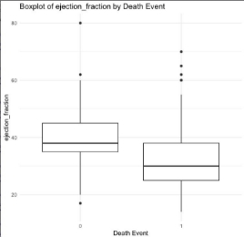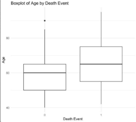

To handle these outliers, we applied Cook’s Distance using a logistic regression model. Since our target variable, "DEATH\_EVENT," is binary, we used Cook’s Distance to eliminate any influential points and outliers, resulting in a cleaner dataset.

After cleaning the data, we checked for normality by creating histograms.

We observed that a lot of variables in our data exhibited right skewness, prompting us to apply a Box-Cox transformation. This transformation helped normalize the data and improve its suitability for modeling.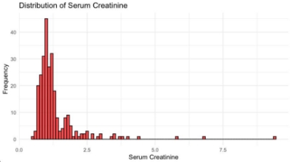

Next, we assessed multicollinearity by calculating the Variance Inflation Factor (VIF). The results showed no signs of multicollinearity, ensuring that our features were not highly 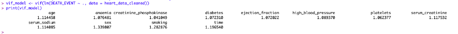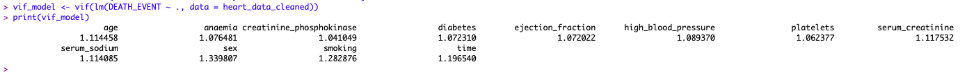correlated with each other.

Since each variable showed a VIF value of less than 2, we deduced that there was no significant multicollinearity between our variables.

We then examined interaction 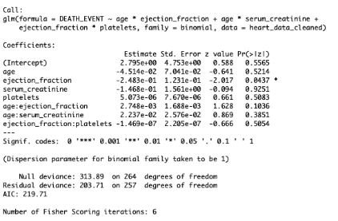term effects using logistic regression. 

Since this new model did not show any significant interaction effect between our variables, we moved on to the process of building our models. 

Now, we split the dataset into training and testing subsets. We initially built a logistic regression model using the training data and evaluated its performance on the test data and got the following confusion matrix: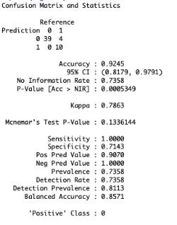

Following this, we refined the model using Lasso and Ridge regression techniques, again evaluating the performance of these models on the test data and got the following confusion matrix by checking the model performance on the test data for each case.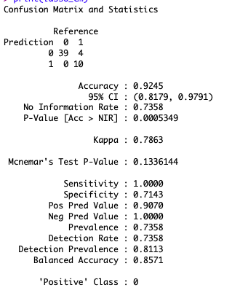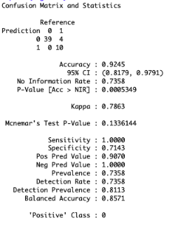

Lasso model:

Ridge model: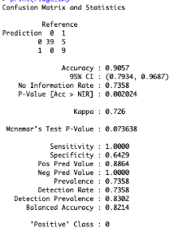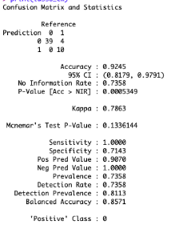

Finally, we constructed a refined logistic regression model by removing insignificant variables identified during our interaction term analysis and evaluated its performance on the test data as well.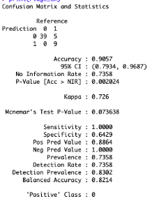

Refined Logistic Model:

We then moved on to compare the AUC values and other metrics of the four models and came to our conclusion:![ref1]![ref2]

|**Metric**|**Logistic Regression**|**LASSO**|**Ridge**|**Refined Logistic Regression**|
| - | - | - | - | - |
|Accuracy|0\.9245|0\.9245|0\.9057|0\.9057|
|Sensitivity|1|1|1|0\.9744|
|Specificity|0\.7143|0\.7143|0\.6429|0\.7143|
|Balanced Accuracy|0\.8571|0\.8571|0\.8214|0\.8443|
|AUC|0\.9945|0\.9872|0\.9872|0\.9377|

**Conclusion:**

Based on the comparison of the four models (Logistic Regression, LASSO, Ridge, and Refined Logistic Regression), the Logistic Regression and LASSO models are the top ones for predicting the likelihood of a death event in heart failure patients. Both models show the highest Accuracy (0.9245), Sensitivity (1.0000), and Balanced Accuracy (0.8571). These models also achieve strong Kappa values (0.7863 for Logistic Regression and 0.7863 for LASSO), indicating excellent agreement between the predicted and actual outcomes.

While Ridge and Refined Logistic Regression show good performance, their Accuracy, Specificity, and Balanced Accuracy are slightly lower than those of Logistic Regression and LASSO.

Therefore, Logistic Regression is the recommended model due to its overall robust performance in predicting heart failure death events. LASSO is a close second and can also be considered, especially for situations where feature selection and model regularization are important.

[ref1]: Aspose.Words.409c28e7-4cbd-45f6-8b15-98fa314a233c.013.png
[ref2]: Aspose.Words.409c28e7-4cbd-45f6-8b15-98fa314a233c.014.png
